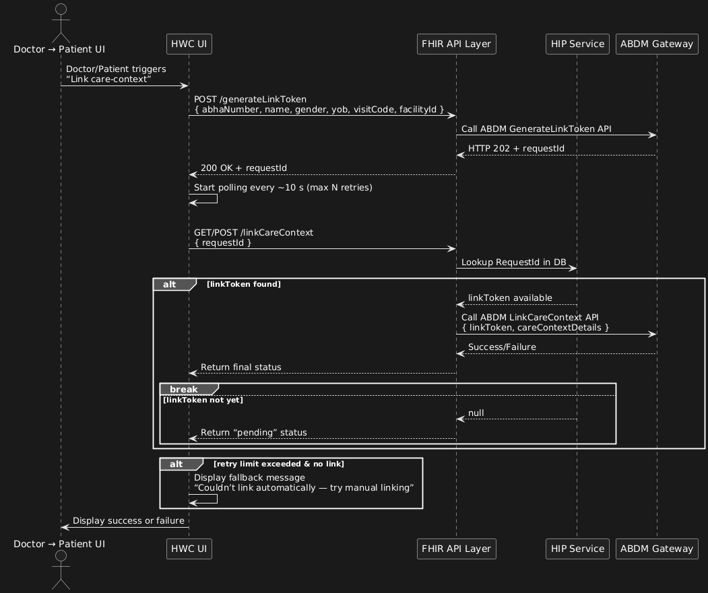
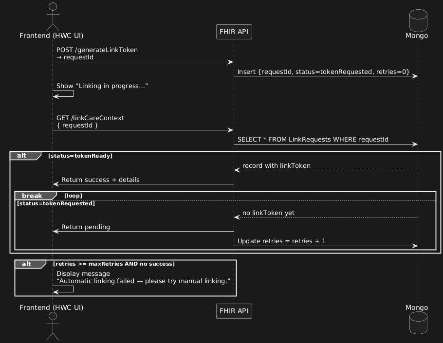
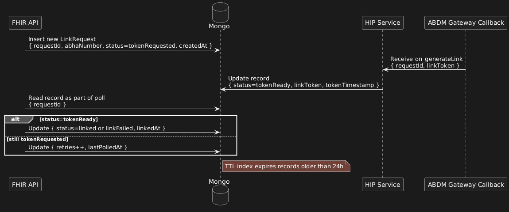

# HIP-Initiated Linking Module

### Overview

This module enables a Health Information Provider (HIP) to initiate linking of a patient’s care-context (hospital visit, OPD record, etc) with the patient’s ABHA (Ayushman Bharat Health Account) as per the ABDM V3 specifications. The system spans UI, FHIR API layer, and HIP service (background processing) and ensures full flow from doctor submission → ABHA link token → care-context linked.

### Scope & Context

* Epic Link: _Upgrade AMRIT ABDM M2 to V3 APIs_
* Service line: Platform
* Environment: All
* Version currently: release-3.9.0 (based on comment on the ticket) AMM-1856
* Tickets:
  * Core Story (API + flow): AMRITAMM-1307
  * UI Changes: AMRITAMM-1811
  * FHIR API Changes: AMRITAMM-1809
  * HIP Service Changes: AMRITAMM-1810
* Dependency on ABDM V3 spec (link token workflow, care-context linking).

### Key Concepts (based on ABDM spec)

* **ABHA Address / ABHA Number**: The unique health account identifier in the ABDM ecosystem.
* **Care Context**: A logical grouping of healthcare records for a patient (visit, prescription, lab result etc) that needs linking with ABHA.
* **Linking Token / RequestId**: In V3 workflows, after authentication/consent, the system issues a token (or requestId) that the HIP uses to link the care context.&#x20;
* **Polling/Async Callback**: Because linking may be asynchronous, HIP may need to poll for token or wait for callback to complete linking.

### Detailed Flow (Module Breakdown)

#### Stage 1: Trigger / Patient Visit Initiation (UI)

* After a doctor submits an encounter in the hospital EMR/portal, the UI triggers a “Link care-context to ABHA” modal. (Ticket 1811)
  * Input fields: ABHA number, Name, Gender, Year of Birth (must match Aadhaar‐registered details).
  * On submit: UI calls `POST /careContext/generateLinkToken` (FHIR layer).
* UI must show a “Linking in progress…” indicator and disable further inputs while waiting for response.
* UI error handling:
  * If name/year mismatch detected → show message: _“Entered details don’t match Aadhaar. Kindly provide Aadhaar-provided name and retry.”_

#### Stage 2: Generate Link Token (FHIR API)

**Endpoint**: `POST /careContext/generateLinkToken`

* Request payload should include: ABHA number, name, gender, yearOfBirth, visitCode, visitCategory, facilityId, facilityName.
* FHIR layer logic:
  * Validate inputs (non-null, ABHA format).
  * Authenticate to ABDM gateway (OAuth2.0/JWT) as required per V3 spec.
  * Call ABDM’s “GenerateLinkToken” API.
    * If HTTP 202 Accepted → capture `requestId` in response.
    * If error (invalid details, duplicate request) → propagate error to UI.
* FHIR returns to UI:

```json
{
  "data": {
    "requestId": "xxxxx-xxx-xxxx-xxxx-xxxxxxxxxxx"
  },
  "statusCode": 200,
  "errorMessage": "Success",
  "status": "Success"
}
```

* Store in data-store (MongoDB or SQL) the mapping: requestId → initial status = “tokenRequested”, timestamp, ABHA number, facility id, etc.
* Logging: record requestId, ABHA number (masked if necessary), timestamp, facility id, retry count = 0.

#### Stage 3: Background Callback Processing (HIP Service)

* The HIP Service (ticket 1810) runs a background job/process that listens for ABDM callbacks (e.g., “on\_generateLink” or equivalent).
* On receiving callback: extract `requestId`, `linkToken`, status (whether token ready).
* Update the data‐store entry (requestId) to status = “tokenReady”, store `linkToken`, timestamp tokenGenerated.

#### Stage 4: Poll & Link Care Context (FHIR API)

**Endpoint**: `GET/POST /careContext/linkCareContext`

* Input: `requestId`
* Logic:
  1. Fetch record by requestId
     * If not found → return `status=pending`, `retry=true`
     * If found but status “tokenRequested” → return `status=pending`, retry
     * If found and status “tokenReady” with `linkToken` → proceed
  2. Use `linkToken` and call ABDM’s LinkCareContext API (send careContext details: each visit/encounter reference, etc)
  3. Evaluate ABDM response:
     * If success → update record status = “linked”, record timestamp, careContextReferences
     * If failure (duplicate, mismatch) → update status = “linkFailed”, record error code/message
  4. Return to UI: success or error
* Polling logic: UI will call this endpoint every \~5 seconds until either success, failure, or retry-limit reached (first try would be instant where next two retries will have an interval of 5 secs)
* Data-store must keep retryCount, lastPolled timestamp, error(s) if any.
* Logging/tracing: record interactions, durations (requestId→token→link), failures for root-cause analysis.

#### Stage 5: UI Finalization

* If FHIR API returns success → UI shows “Care context linked with your ABHA successfully.”
* If FHIR API returns failure with specific error → UI shows user-friendly message (map internal error codes to UX messages).
* If UI retries exceed threshold (e.g., 5 tries) and still “pending” → show fallback: _“We couldn’t link automatically. Please try manual linking or contact staff.”_
* Optional: UI logs this fallback event for system analytics.

### Sequence Diagrams (PlantUML)

#### 1. Full End-to-End Sequence

<figure><figcaption></figcaption></figure>


#### 2. Polling & Re-try logic sub-flow

<figure><figcaption></figcaption></figure>

#### 3. Data Store & Background Callback Processing

<figure><figcaption></figcaption></figure>
